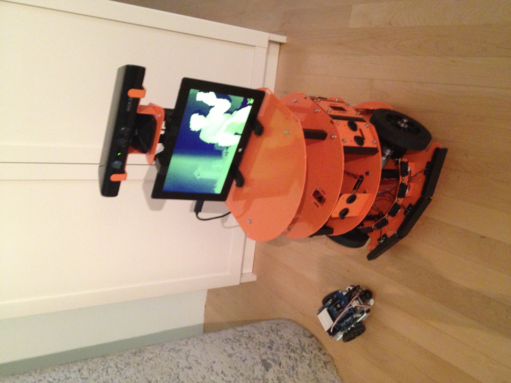

# HCR Bot

For my second robot I puchased and built a HCR kit. This kit was much larger than the first sumobot I built, and has a lot more room to build on. The robot was powered by a small 12vDC motorcycle battery. Initially I had it randomly roaming with basic distance sensors and collision sensors on the front.

Eventually I implemented basic human tracking using the kinect sensor and OpenNI. This robot was built using Node.js due to great library support and needing a fast processor to process the 3d data from the kinect. As there is a lot of room to build on this robot, I'm hoping to take it much further in the future.