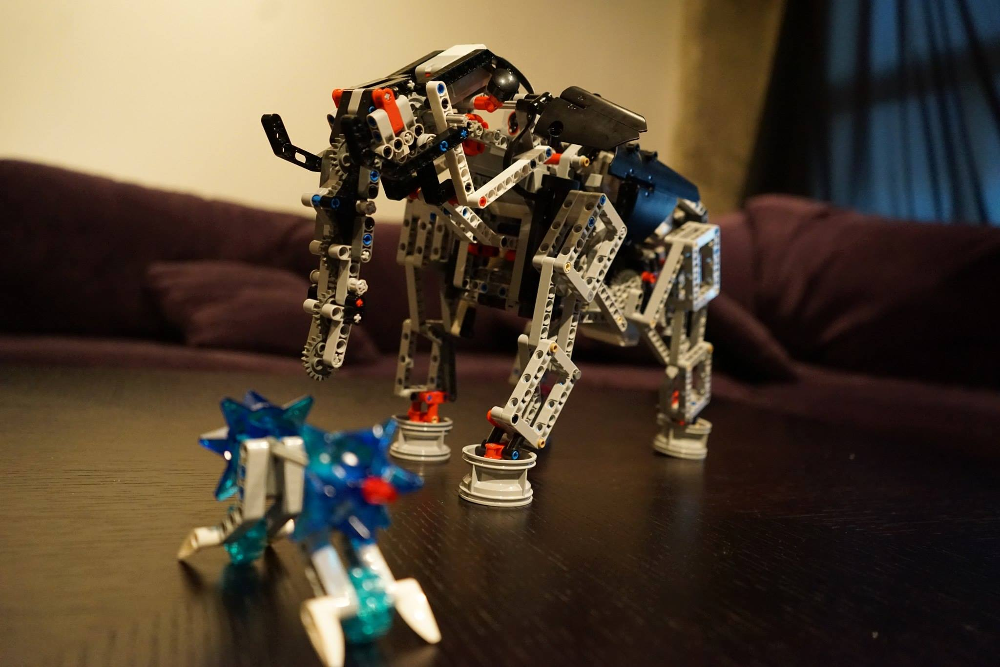

# Lego Mindstorm Elephant

Built using lego, but programmed using node.js and ev3dev. Simple controls allow the elephant to move forward or backwards, and move it's head. This is a work in progress.
