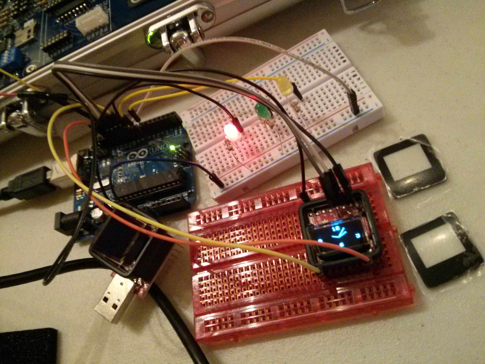

# Microview Experiments

Pictured: Restoring a broken Microview bootloader. 

* https://www.kickstarter.com/projects/1516846343/microview-chip-sized-arduino-with-built-in-oled-di/posts/959475
* https://learn.sparkfun.com/tutorials/installing-a-bootloader-on-the-microview
* http://makezine.com/2014/08/21/how-to-fix-your-broken-microview/
