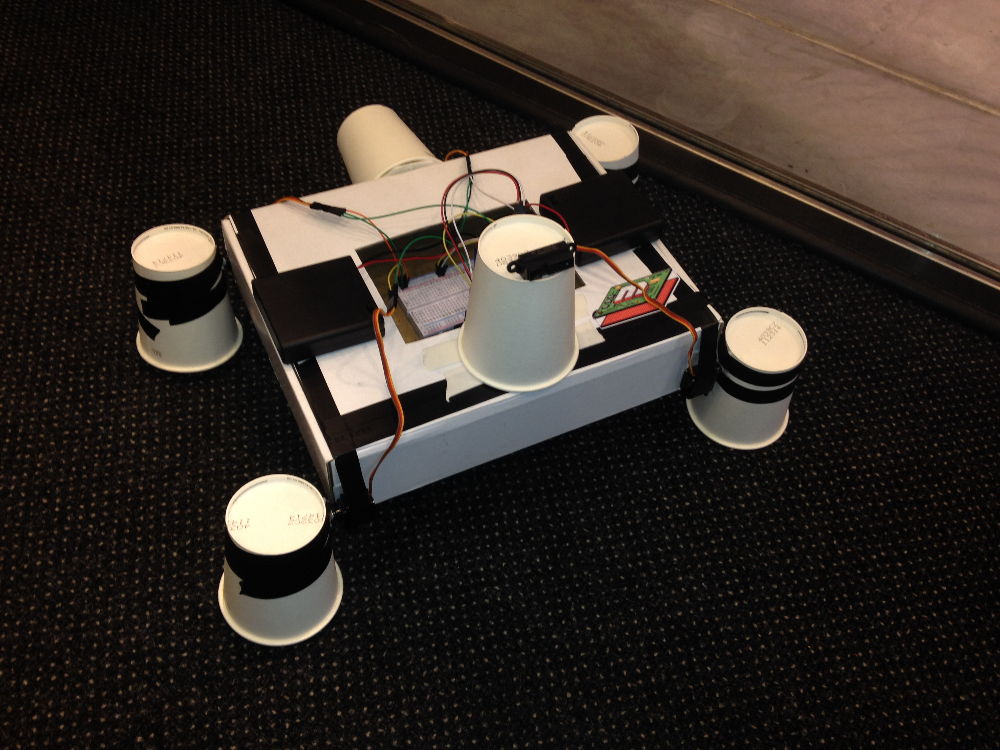

# CupBot - Makerland Hackathon Project

Makerland 2014 was a three-day maker conference in Warsaw, Poland. Makers from around the globe gathered to learn and practice 3d printing, electronics, circuitry, wearables, automation and more. At the end of the conference attendees hack all day on a project of their choosing.

My project started off to be fairly ambitious, possibly some kind of rocketship. Unfortunately due to a lack of hardware I had to settle with CupBot in his current form. Although he does not blast off into space, CupBot does scuttle across the floor, and backs up when something trips his distance sensor.