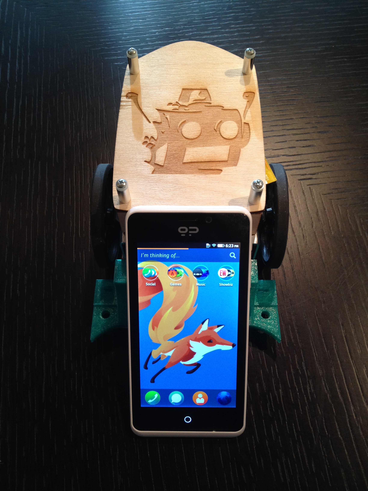

# Sparky - FirefoxOS Edition

Sparky makes a return featuring a FirefoxOS remote control. I wanted to create a basic robot which utilizes FirefoxOS and the power of the web. The robot is controlled by a single microcontroller - the SparkCore. This is a really simple way of creating a robot as there is no need to have a USB connection or running webserver. All you need is a wifi connnection. The remote control is a FirefoxOS device running an application which listens to the devicemotion event. As you move the device, it sends signals to the robot depending on the tilt of the device. Tilt forward, and backwards to move, left and right turn the robot. You can find the code for the FirefoxOS application inside of: ./sparky_fxos.
