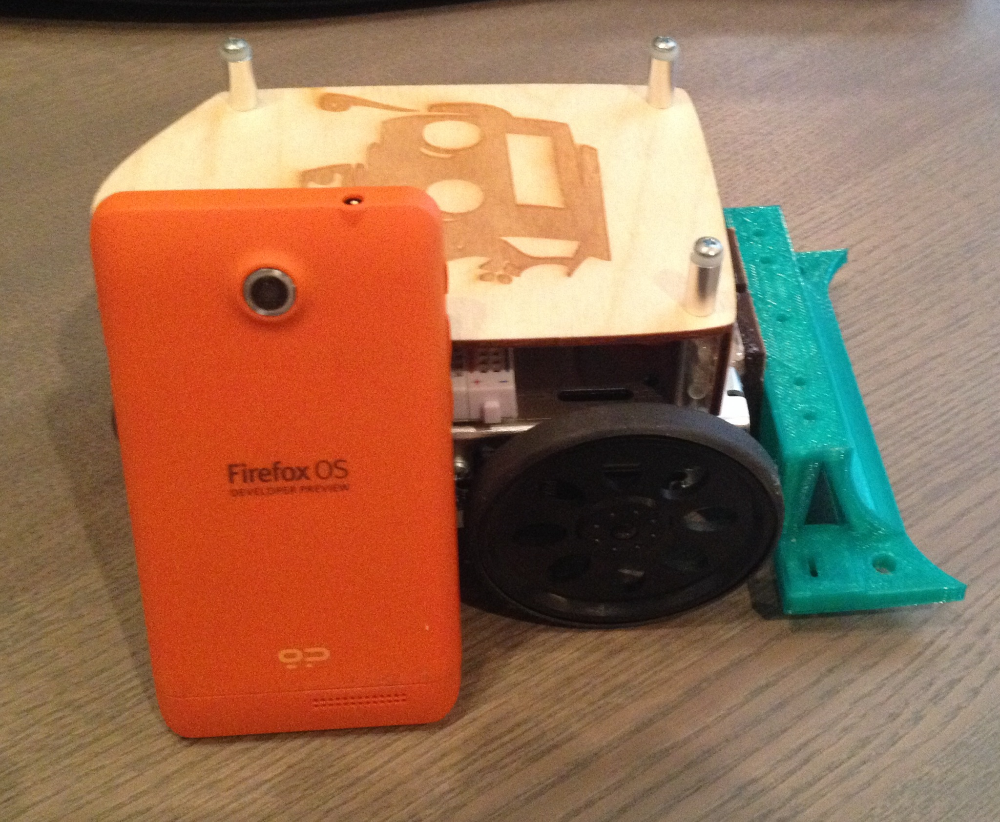

# Sparky - FirefoxOS Edition

Sparky makes a return featuring a FirefoxOS remote control. I wanted to create a basic robot which utilizes FirefoxOS and the power of the web. The robot is controlled by a single microcontroller - the SparkCore. This is a really simple way of creating a robot. There is no need to control an arduino over USB with a Raspberry PI or setup a webserver. All you need is a wifi connnection. The remote control is a FirefoxOS device running an application which listens to the orientationchange event. You can find the code for the FirefoxOS application inside of: ./sparky_fxos.
