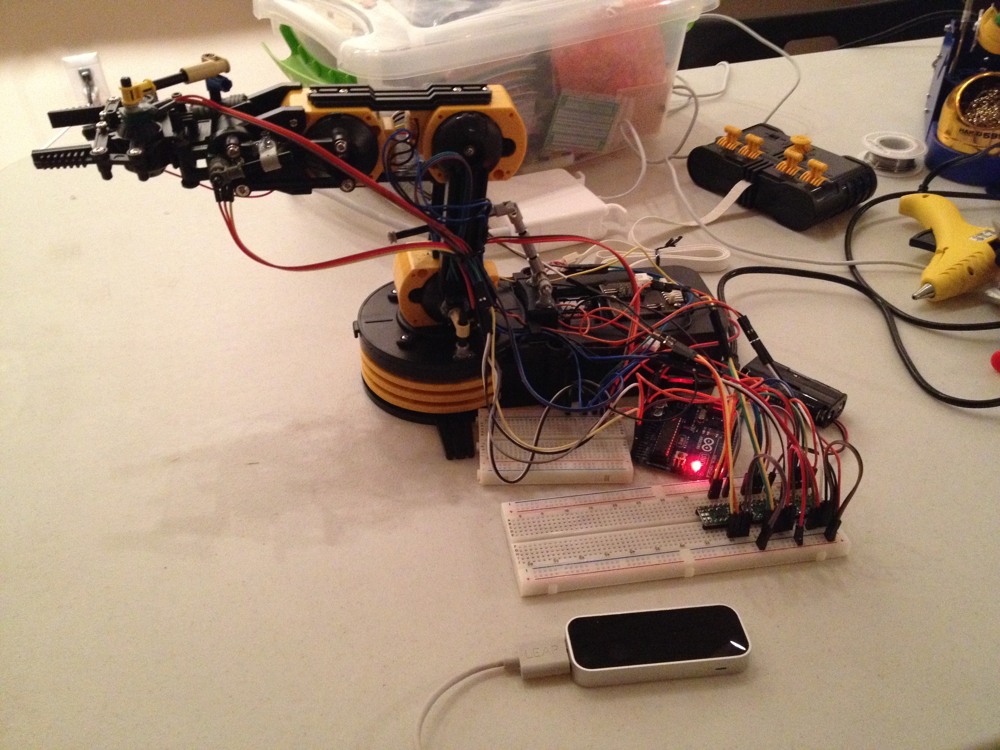
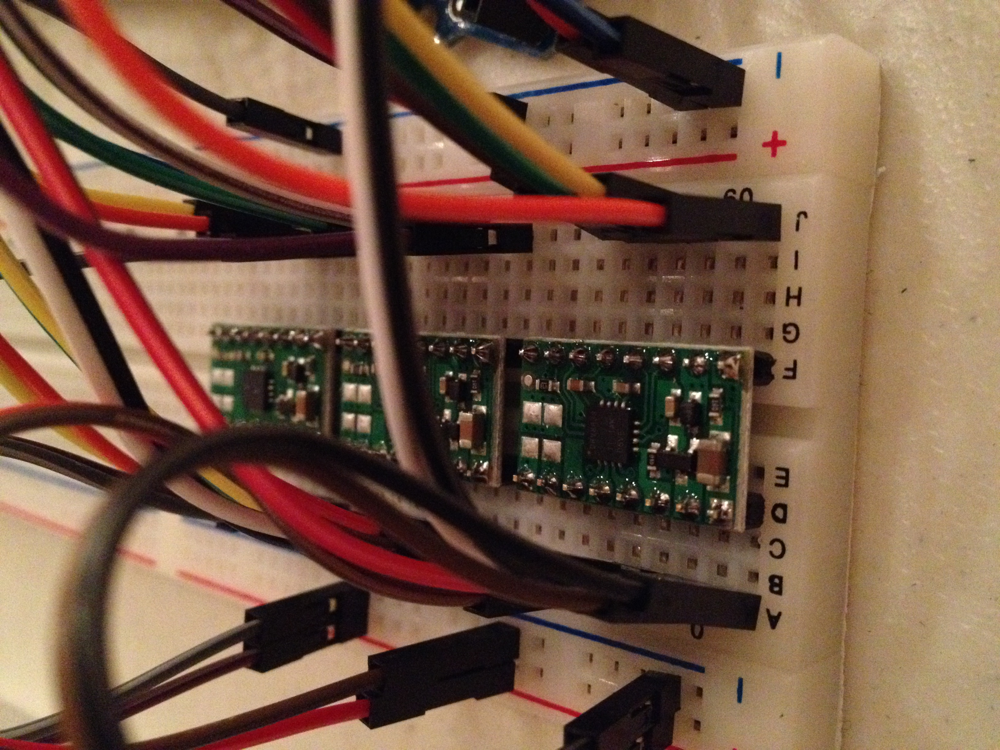
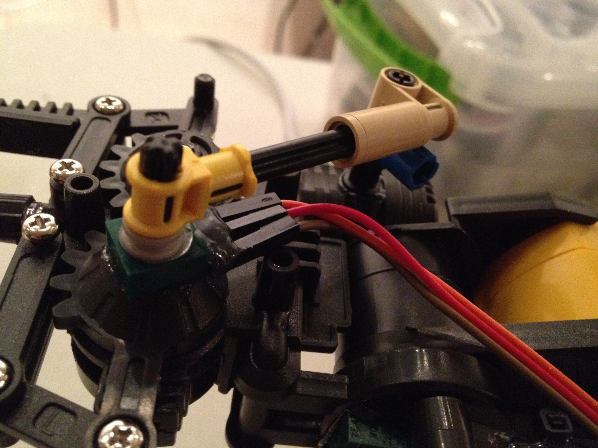
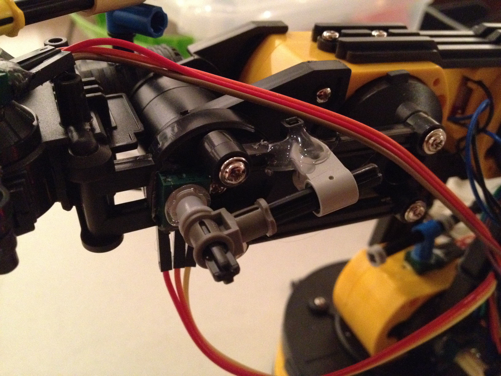
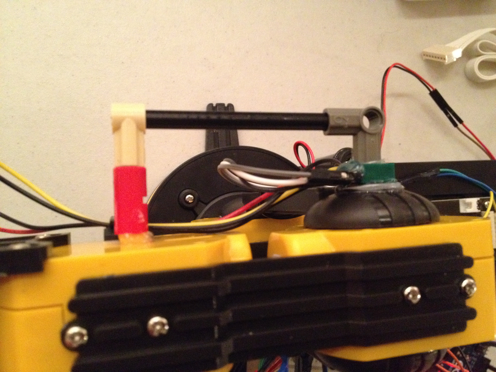
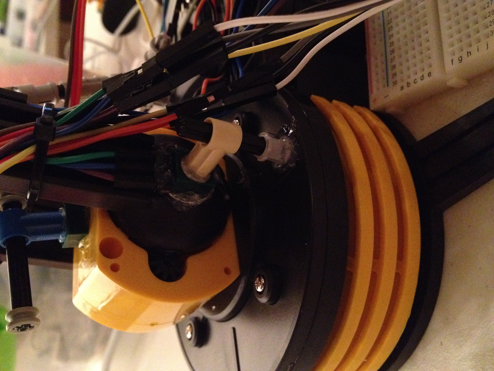
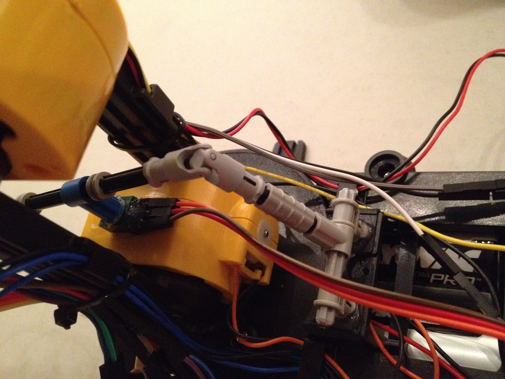

# OWI Robot Arm - Hacked!

http://www.amazon.com/OWI-OWI-535-Robotic-Arm-Edge/dp/B0017OFRCY

The OWI Robotic Arm is a great little robotic arm with 5-degrees of freedom. It comes with a remote control with which you can manually control the robot. Unfortunately, there's no way to script the robot out of the box. While it's probably cheaper, and more efficient, to build your own robot arm using servos - trying to rig this thing up to an arduino can be quite the adventure. Taking this a step further, I wanted to be able to control the robotic arm using a Leap Motion, hooked up to my laptop.

## Controlling Motors

I used a great little dual motor driver from Pololu here: http://www.pololu.com/product/2130. Each one of these can control two motors, utilizing PWM for speed control. Being that there are five motors on the robotic arm, you will need three of these motor drivers if you want to control all of them.

## Adding Potentiometers

Each degree of freedom is powered by a simple DC motor. In order to have a closed-loop feedback system, you'll need to add potentiometers to each joint. You can do this in a number of ways, I decided to use lego rods to connect to each trim pot. Pictures of implementation to follow:

## Software

I'm currently using a WebSocket to connect to the Leap Motion server, and utilizing PinIO (https://github.com/kevingrandon/pinio) to drive the arduino. I'm currently wiring both the Leap Motion and Arduino to my laptop, but may experiment with a completely wireless claw in the near future. I have some sample code in robot_arm.js, and plan to upload more fully-featured code when time permits.