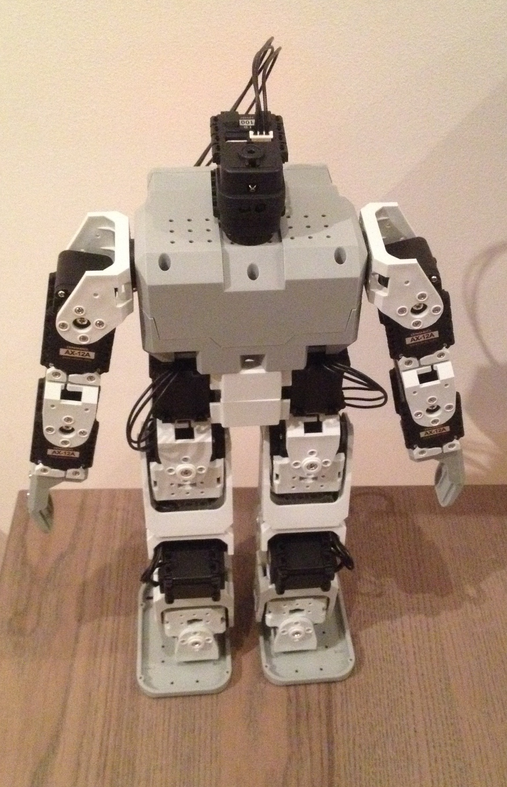

# Bioloid Humanoid Robot

I had the Bioloid Comphrensive kit sitting around for a while so I finally decided to put it together. Assembling this thing was extremely tedious with the hundreds of tiny bolts and screws. Once together, it makes a nice little humanoid robot - though taking it apart is a task I dread.

The servos that this thing come with are really nice. They are networked and have a status led embedded within them. The built in microcontroller allows you to track its speed, temperature, shaft position, voltage, and load. I'm looking forward to doing more experiments with these servos.

Out of the box, the robot has several commands. Simply change the mode to 'play', and press one of the following buttons:

Start Button - Performs a dance
U: Dance whenever you clap
L: Attack mode. Performs an attack when it senses your presence.
R: Lay down and stands up whenever you clap three times.
D: Walk around, avoiding obsticles.

I have not yet taught him to do Gangnam Style yet, but perhaps that's next: http://www.youtube.com/watch?v=3X5YUzSOsCI