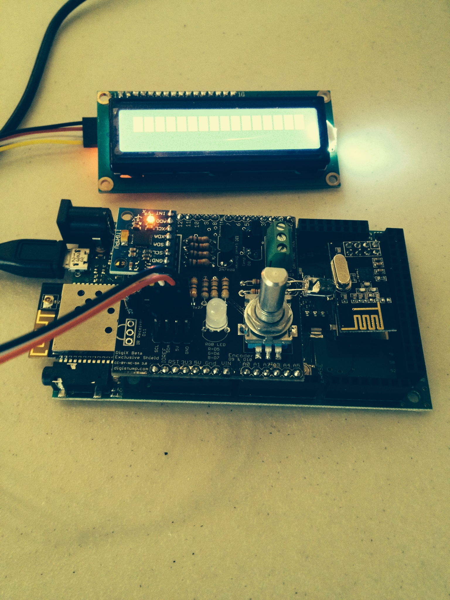

# Digistump DigiX

I backed the Digix on Kickstarter and have been doing various experiments with it. It's a great little board with WiFi and Mesh networking, Audio, USB OTG, MicroSD, EEPROM, and 99 i/o pins.