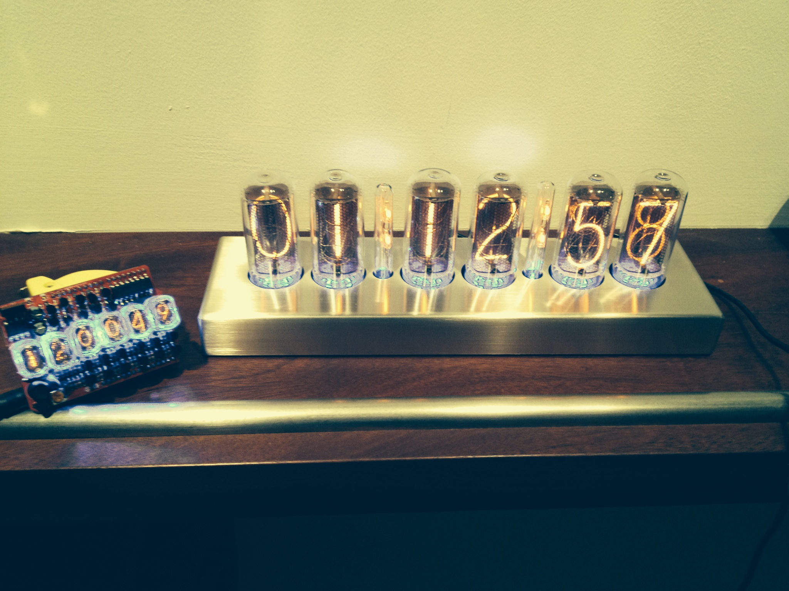

# Nixie Clock

Experimentations with nixie tubes using two different kits. One was a kickstarter arduino shield kit, and the other one is called "Blue Dream". They use IN-17 and IN-18 nixie tubes.

http://en.wikipedia.org/wiki/Nixie_tube

https://vine.co/v/hrtwbBbK75Y
