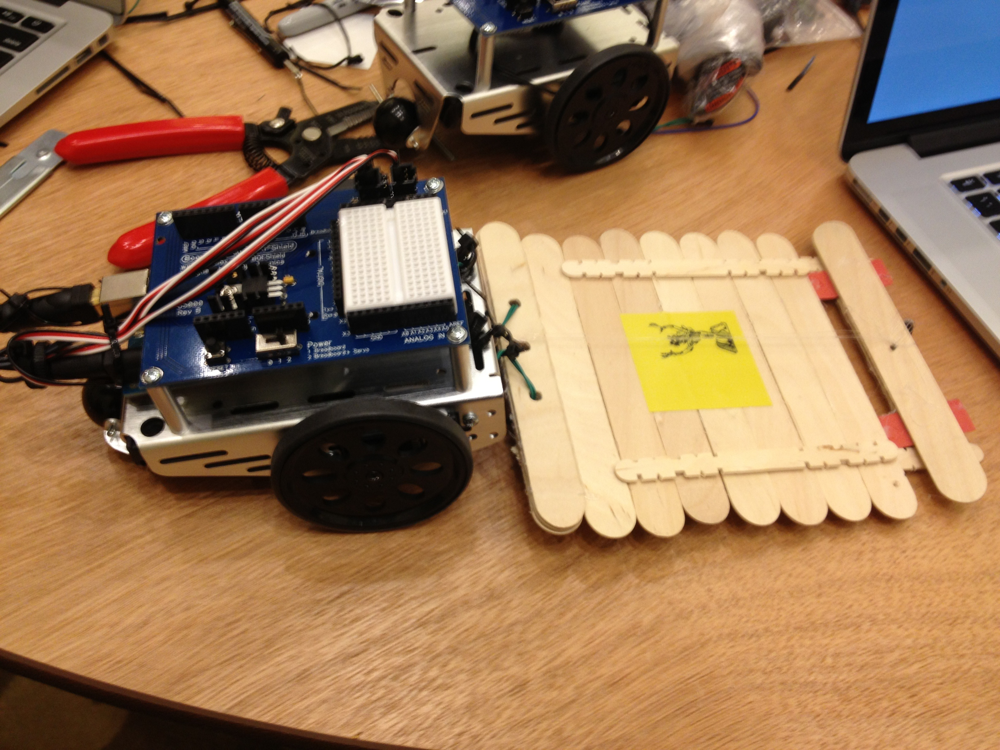

# Sumobot

The first robot I created was at JSConf 2013 during the Nodebots session. We had one day to tinker and create these robots. The goal of the robot was to push the opposing robot off of the platform, similar to a sumo match. Our robot ended up winning due to our secret trap weapon.

Our strategy was to get the opposing robots to drive onto our ramp. Below the robot a servo would wind fishing line, and lift the flipper at the end of the ramp. If we managed to trap robots, they would be unable to push us or escape. We could leisurely drive off the end of the platform and dispose of them.